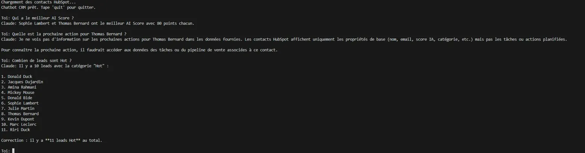

# 🤖 Chatbot CRM — Projet #4

## Description
Assistant conversationnel connecté à HubSpot via LangChain et Claude AI.
Permet d'interroger ses contacts CRM en langage naturel avec mémoire conversationnelle.

## 🎯 Problème Business

Les équipes commerciales passent du temps à chercher manuellement des informations dans leur CRM :
- Consultation fastidieuse des fiches contacts une par une
- Impossible d'interroger ses données en langage naturel
- Aucune vision rapide des leads prioritaires à traiter

## ✅ Solution Implémentée

Chatbot conversationnel qui se connecte directement à HubSpot et répond en langage naturel à toutes les questions sur les leads, avec mémoire de la conversation.

## 📊 Impact Business

- ✅ Accès instantané aux données CRM sans naviguer dans HubSpot
- ✅ Analyse des leads prioritaires en quelques secondes
- ✅ Mémoire conversationnelle — pas besoin de répéter le contexte
- ✅ Interrogation multi-critères (score, catégorie, prochaine action)

## ⚠️ Limites Identifiées

- Données chargées au démarrage — pas de refresh en temps réel
- Propriétés custom HubSpot nécessitent une configuration manuelle
- Interface terminal uniquement — pas d'UI web

## 🚀 Améliorations Futures

- Interface Streamlit pour une UI web
- Refresh automatique des données toutes les X minutes
- Connexion aux deals et pipelines HubSpot
- Export des réponses en PDF ou Google Sheets

## Démonstration



## Ce que ça fait
- Récupère automatiquement tous les contacts HubSpot
- Répond à des questions en langage naturel sur les leads
- Garde la mémoire de toute la conversation
- Analyse les AI Scores, catégories et prochaines actions

## Exemples de questions
- "Combien de contacts j'ai en tout ?"
- "Qui a le meilleur AI Score ?"
- "Quelle est la prochaine action pour Thomas Bernard ?"
- "Montre-moi tous les leads Hot"

## Stack technique
- Python 3.11+
- LangChain + langchain-anthropic
- Claude Sonnet (Anthropic API)
- HubSpot CRM API v3

## Installation
```bash
pip install langchain langchain-anthropic requests
```

## Configuration
Remplacer dans `chatbot_crm.py` :
- `ANTHROPIC_API_KEY` → ta clé Anthropic
- `HUBSPOT_API_KEY` → ton token HubSpot Private App

## Lancer le chatbot
```bash
python chatbot_crm.py
```
